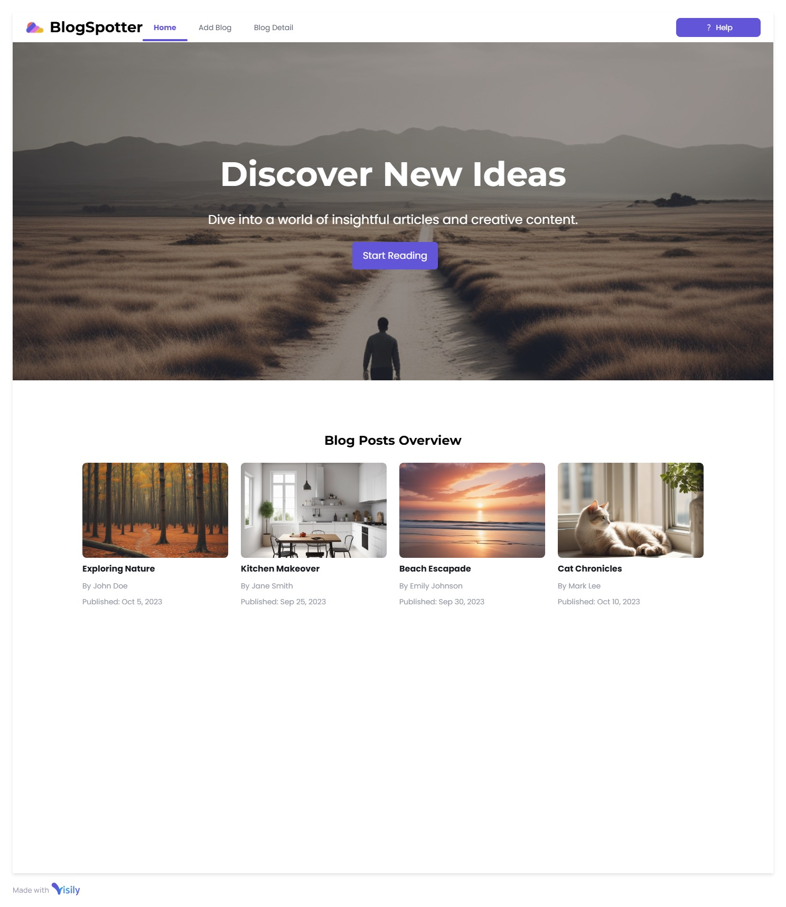

# Blog Website

A **modern and responsive** Blog Website built using **React.js (frontend)** and **Node.js with Express.js (backend)**. Users can **add a blog, view blogs on the homepage, and read a blog on a separate page**.

## Features

### 1. Homepage
- Displays a list of blogs with **title, author, date, and a short excerpt**.
- A **hero section** with a welcome message and a button to add a new blog.
- A **navigation bar** with links to "Home" and "Add Blog".

### 2. Add Blog Page
- A form with fields for **title, author, content, and category**.
- A **Submit button** to save the blog post.
- Sends data to the backend API and stores it in **MongoDB**.

### 3. View Blog Page
- Each blog opens on a **separate page** when clicked.
- Displays **full blog details**, including **title, author, date, and content**.
- Includes a **back button** to return to the homepage.

## Tech Stack
- **Frontend:** React.js, React Router, Tailwind CSS
- **Backend:** Node.js, Express.js, MongoDB

